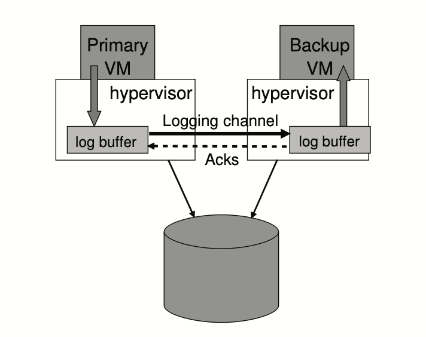

## 1. What is FTVM 

### Introduction

From the title of the paper [1], this paper focuses on designing a fault-tolerant system. More specifically, FTMV (Fault-Tolerant Virtual Machines) achieves fault-tolerant by replicating the execution of a primary virtual machine via a backup virtual machine on another server.

### Challenges
Using replication for a fault-tolerant system would introduce some common problems. Here are three challenges that FTVM mainly concerns about. 
* **Split-Brain**: The primary has a backup for itself in FTVM, however, the situation of two primaries must be avoided. Especially when the network partition happens, the backup should do test-and-set to ensure the primary is failed and take over the leadership. 

* **Keep-in-sync**: Keeping the primary and the backup in sync is complicate but important. Keep-in-sync means that, all changes applied to the primary should be same as the backup in the same order. Therefore, FTVM has given some methods for avoiding divergence between the primary and the backup. 

* **Failover**: In FTVM, the failover is transparent to clients. The effective scheme should be designed to guarantee that clients would not detect any inconsistency during the failover. 

## 2. Overview 

### Structure

There are several notable components of FTVM's structure (Figure 1), including VMM (Virtual Machine Minitor), logging channel and storage server. 


<p style="text-align: center;">Figure 1: The structure of FTVM. Adapted from [1].</p>

#### VMM

VMM, also known as hypervisor, is the paltform for managing the virtual machine which runs on the top of it. VMM has full control over the execution of a VM. Additionly, VMM acts as the middle layer between upper system (e.g. Linux) and physical device so that the interrupt from hardware would not be observed straightly by the system or the apps on the top.

#### Logging Channel

The logging channel can be considered as the bridge between two VM's local bog buffers. The primary acts as productor that produces log entries to its log buffer, while the backup acts as consumer that consumes log entries from its log buffer. It is worth mentioning that the backup sends Acks to the primary once it receives log entries from the logging channel over the network

#### Storage Server

The storage server is a shared server which is accessible for the primary and the backup (gray bucket in Figure 1). The storage server serves two purposes: 1)store states of the primary and the backup, 2)in charge of the arbitration during the failover.

### Implementation

#### Keep-in-sync

How to maintain the consistency in a distributed sysytem is always tricky and expensive for the cost of performance. FTVM discards traditional approaches of replicating states of servers, instead it keeps the primary and the backup by ***modeling deterministic state machines with extra information***. The extra information are sent from the primary to the backup any time something happens that might cause the execution to diverge.

##### Output Rule

Furthermore, FTVM holds the Output Rule to guanruntee the consistency which could ensure the backup has received all log entries of the primary when the primary failed.

> **Output Rule**: the primary VM may not send a output to the external world, until the backup VM has received and acknowlegded the log entry associated with the operation producing the output

##### Divergence 

To avoid the divergence between the primary and the backup, some extra information need to be sent. There are serveral typical divergence sources: __1) I/O with external world__ (e.g. network packets, disk I/O), __2) timer interrupts__, __3) non-deterministic instructions__ (e.g. random number, current time). The extra information could be the appropriate position of a interupt in the instruction stream, or final results of non-deterministic operations. 

#### Failover

A failover happens if the primary fails or the backup recognizes that the primary fails. If the primary indeed fails for some reasons, the backup will take over with no doubt and there is no inconsistency in the view of clients. However, if the network partition that causes the primary and the backup to lose communications from each other, the backup should not take over straightly because there may be two primaries once the network partition disappears.

FTVM uses the atomic `test-and-set` method to avoid the potential problem discussed above. More specifically, once failover happens, the primary and the backup should do `test-and-set` in shared storage server to get the leadership exclusively. If `test-and-set` reutrns true, the server will become the new primary. Otherwise, the server will eliminate itself.
```
test-and-set():
    acquire_lock()
    if flag == true:
      release_lock()
      return false
    else:
      flag = true
      release_lock()
      return true
```

## 3. Key Points

### Virtualization

FTVM's design is based on replicating the execution of a primary VM via a backup VM using VMware deterministic replay. FTVM fully exploits the virtualization of VMs and therefore avoids the difficulty of ensuring deterministic executions on physical machines.

VMM emulates a local disk interface but actual storage is on a network server (storage server). It can be treated much like a client: usually only primary communicates with the storage server (backup's FT discards). If backup goes live, it talks to the storage server. External storage makes creating a new backup faster (don't have to copy primary's disk).

### Transparent Replication

The primary's replicaiton in FTVM is transparent to clients and appears like a single server. The possible differences between a a FTVM and a single server are: __1)__ clients' request cost more time to wait Acks from the backup, __2)__ clients may send one request more than once while failover happens.

## 4. Summary 

## Reference

[1] Scales, Daniel J, Mike Nelson, and Ganesh Venkitachalam (2010). The design of a practical system for fault-tolerant virtual machines.