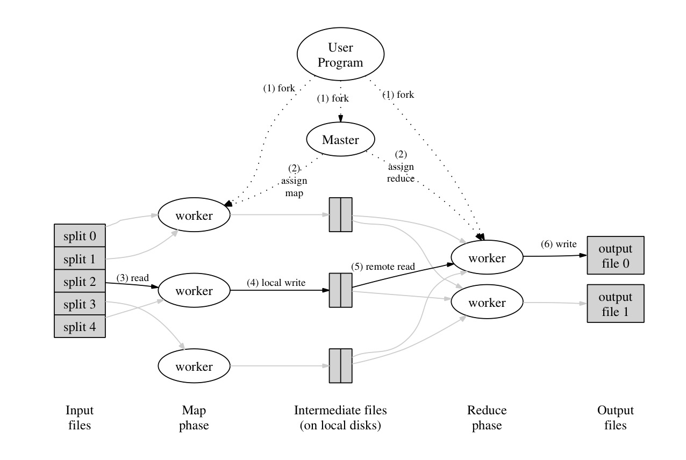

## 1. What is MapReduce

### Introduction

MapReduce is a programming model with abstract interfaces that aims for processing and generating large datasets. MapReduce comprises two basic function interfaces, Map and Reduce, which can be defined by users and enables automatic parallelization and distribution of large-scale computations.

### Chanllenges

#### Large Data

The motivation of MapReduce is processing large amout of raw data more effectively. Therefore, the input data must be distributed across hundreds or thousands of machines in order to accelerate the computation. They prime chanllenge that arises with large data is how to distribute the data and parallelize the computation.

#### Fault tolerance

Once the distributed system is introduced, it is always tricky for designers to avoid all possible machine failures. Therefore, some effective mechanisms should be built to detect and deal with failures.

## 2. Overview

#### Execution Procedure

The execution of MapReduce comprises two phases (Figure 1), Map phase and Reduce phase. In Map phase, input files divided into M splits would be processed in parallel by workers using the specific Map function across multiple machines. Workers will then partitioning the intermediate key/value pairs into R pieces and write them into local disks after Map phase. In Reduce phase, workers use remote read to access all intermediate files and merge them into final output files by the specific Reduce function.

Figure 1: Execution overview of MapReduce. Adapted from [1].

#### Map phase

Map function, written by the user, takes an input pair and produces a set of intermediate key/value pairs. The MapReduce library groups together all intermediate values associated with the same intermediate key and passes them to the Reduce function. In a word, the effect of Map is decomposition of input files in the granularity of key/value. Users could specify an Combinar function to do pre-reduce of key/value pair locally in Map phase, which would significantly speed up certain classes of MapReduce operations.

It is worth mentioning that the MapReduce master takes the location information of the input files into account and attempts to schedule a map task on a machine that contains a replica of the corresponding input data, which would save network bandwidth resources greatly. For the same reason, workers do the local write of intermediate files.

#### Reduce phase

The Reduce function, also written by the user, accepts an intermediate key and a set of values for that key. It merges together these values to form a possibly smaller set of values. Reduce phase is not kicked off until all Map tasks have been completed. 

A reduce worker first reads all intermediate data and then sorts it by the intermediate keys so that all occurrences of the same key are grouped together. The sorting is needed because typically many different keys map to the same reduce task.

## 3. Key Points

#### Abstract Model
MapReduce constructs a highly abstract model that decomposes all tasks into two phases and makes it easy to parallelize and distribute computations on large datasets. By specifying Map and Reduce function, users could complete tasks with large datasets easily without knowing any detail of implementation.

#### Fault tolerance

* **Failover**: MapReduce has a basic mechanism to handle with failures. For worker failure, master pings every worker periodically to detect it in time and re-execute the task on another worker. For master failure, MapReduce just aborts the all procedures and exits. MapReduce uses atomic commits of Map and Reduce tasks to gunrantee the correctness of re-execution of tasks since Map and Reduce functions are deterministic. More specifically, a map worker will send all intermediate files' locations to the master only if the worker completes it successfully, and the master would reject the outdated workers' requests. A reduce worker uses atomic rename to maintain consistency.

* **Straggler**: Re-executions can also be used to reduce the impact of slow machines (stragglers). When the MapReduce operation is close to completion, there may have some workers who lengthens the total time because of some local problems. The master schedules backup executions of those remaining in-progress tasks to speed up the total operation.

## 4. Summary

## Reference

[1] Dean, J., & Ghemawat, S. (2008). MapReduce: simplified data processing on large clusters. Communications of the ACM, 51(1), 107-113.