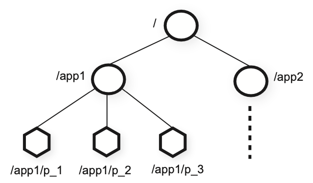
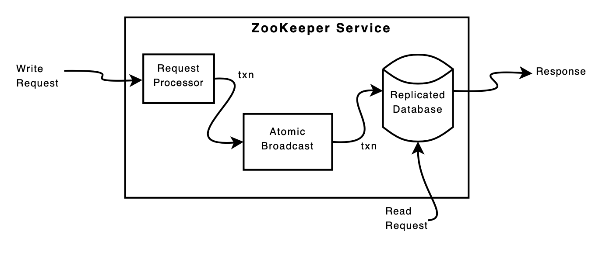

## 1. What is ZooKeeper 

Just as the paper[1] said, ZooKeeper is a ___wait-free___ coordination service with ___relaxed consistency guarantees___ for use in distributed systems. ZooKeeper provides with simple but high performance APIs at the client side. 

## 2. Overview

### Structure 

#### File System-like

ZooKeeper constructs the hierachical name sapce using uses the standard *UNIX* notation for file system paths (Figure 1). ___The data model of ZooKeeper is essentially a file system with some APIs.___ However, ZooKeeper only stores meta-data for coordination service instead of general data in a certain structure, calls **Z-Node**.

Figure 1: ZooKeeper hierarchical name space. Adapted from [1].

#### Z-Node

Clients can create Z-Node in ZooKeeper which clients will interact with. 
* **Regular**: Clients manipulate regular znodes by creating and deleting them explicitly.
* **Emphemeral**: Clients create such znodes, and they either delete them explicitly, or let the system remove them automatically when the session that creates them terminates (deliberately or due to a failure).
* **Sequential**: Additionally, clients could create a new znode with a sequential flag set. Nodes created with the sequential flag set have the value of a **monotonically increasing** counter appended to its name. The sequential flag makes all nodes under one parent node sorted with their created time.

#### Watch Mechanism
The read request could using watch for possible update in the future. The write request may trigger the notification of all clients related.

**Wait for update**: ZooKeeper uses a watch mechanism to enable clients to cache data without managing the client cache directly. With this mechanism, a client can watch for an update to a given data object by sending request with a watch flag set, and receive a notification upon an update. Obviously, watch mechanism works for the read request. 

**Trigger notification**: When a server processes a write request, it also sends out and clears notifications relative to any watch that corresponds to that update. Only the server that a client is connected to tracks and triggers notifications for that client.

### Request Processing

The most difference between ZooKeeper and other services is that ZooKeeper processes read request and write request in different ways. That is, processing read requests locally at any server but processing write request by the leader. The processing flow of the read request is much more simple than the wirte request's (Figure 2). 

Figure 2: Pipeline of ZooKeeper Service. Adapted from [1].

#### Write Request

All write requests from a client at any server will redirect to the leader in a batch. Leader tags every write request with an increasing number, `zxid`, which could be considered as the entry index in RAFT. The max `zxid` of a server corresponds to the last transaction seen by the server and indicates how up-to-date the server's log is. Every client of a server keeps the `zxid` no less than the `zxid` of its last write. 

#### Read Request

Each read request is processed and tagged with a zxid that corresponds to the last transaction seen by the server. This `zxid` defines the partial order of the read requests with respect to the write requests. The read request only interact with one of all servers, so the read request may get stale data for some reasons: __1)__ replica may not be in majority, so may not have seen a completed write. __2)__ replica may not yet have seen a commit for a completed write. __3)__ replica may be entirely cut off from the leader.

## 3. Main ideas

### High performance

* **Asynchronous operations**: ZooKeeper uses a simple pipelined architecture which allows clinet to have multiple operations outstanding at a time. Clients could take many write operations in serializable, and all operations would be sent to the leader in the pipeline which is more efficient over the network. Additionally, ZooKeeper guarantees FIFO for client operations.
  
* **Process read requests locally**: Caching data on the client side is an important technique to increase the performance of reads. ZooKeeper allows servers to process read requests locally even though the client may get stale data of read requests, the performance of reading would be increasing scaleable with the number of servers. ___Read in ZooKeeper means "read on your own writes"___. Getting stale data is not as painful for programmers as it may seem but very helpful for read performance.
  
### Weak consistency

By changing the definition of read-correctness, ZooKeeper sacrifices the consistency of read requests on different servers for high performance on processingread requests. This design choice is key to achieving the goal of excellent performance with ___read-dominant___ workloads. Additionly, it's convenient for clients to get latest data by using `sync` followed by a read request.

## 4. Summary

## Reference

[1] Hunt P, Konar M, Junqueira FP, Reed B (2010). ZooKeeper: Wait-free Coordination for Internet-scale Systems.

